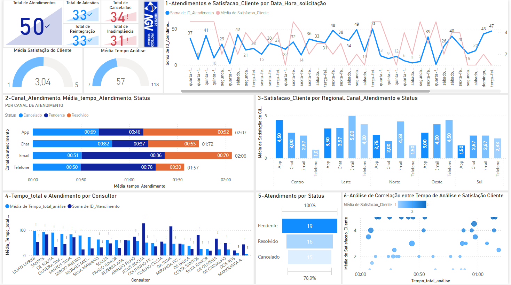
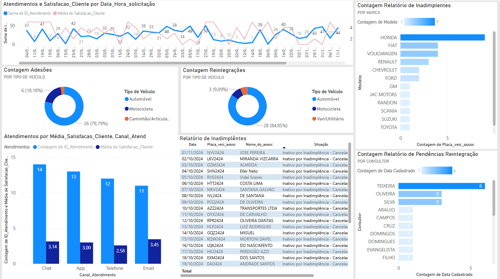
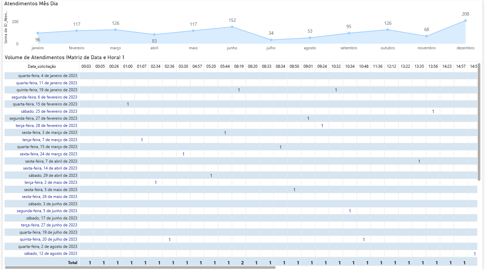
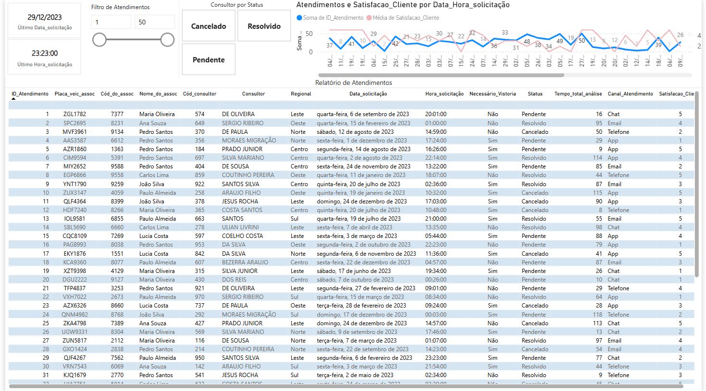
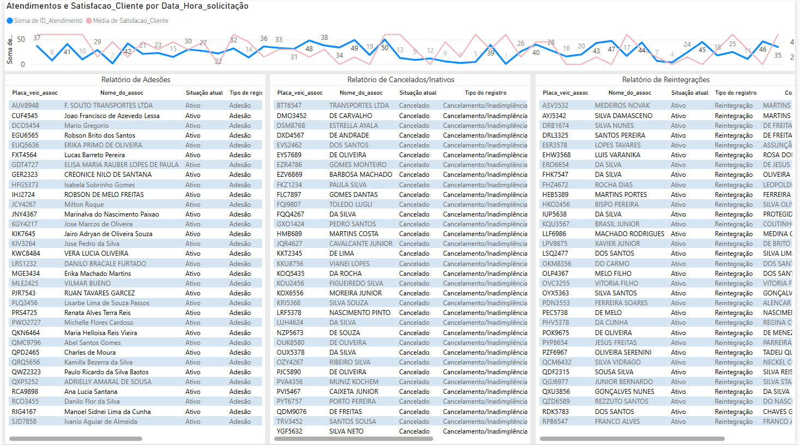

# Consultoria Universo AGV

`CURSO: Sistemas de Informação`

`DISCIPLINA: Projeto - Trabalho de Conclusão de Curso`

`SEMESTRE: 8º`

Relatório apresentado à disciplina Projeto de Conclusão de Curso, do curso de Sistemas de Informação Puc Minas como requisito parcial para aprovação na disciplina, sob a orientação da prof.ª Simone Fernandes Queiroz.

## Integrantes

* Cleverson Christian da Rocha
* Luiz Carlos Muschioni
* Maitê Luise Freitas de Almeida Santos
* Thainara Pereira Dias

## Orientador

* Prof.ª Simone Fernandes Queiroz

# Planejamento

<li><a href="src/relatorio-et1_Grupo01_Universo-AGV.pdf">Etapa 1 - Definição da organização e estudo do negócio e seu mercado</a></li>
<li><a href="src/relatorio-et2_Grupo01_Universo-AGV.pdf">Etapa 2 - Plano de Inteligência Competitiva (IC)</a></li>
<li><a href="src/relatorio-et3_Grupo01_Universo-AGV.pdf">Etapa 3 - Desenvolvimento de alternativas de soluções de SI</a></li>
<li><a href="src/relatorio-et4_Grupo01_Universo-AGV.pdf">Etapa 4 - Planejamento Estratégico de TI (PETI)</a></li>
<li><a href="src/relatorio-et5_Grupo01_Universo-AGV.pdf">Etapa 5 - Avaliação e Gestão Contínua de TI</a></li>

# Código

# Apresentação

<li><a href="presentation/Apresentação eixo 8.pptx.png">Apresentação da solução - Universo AVG</a></li>
